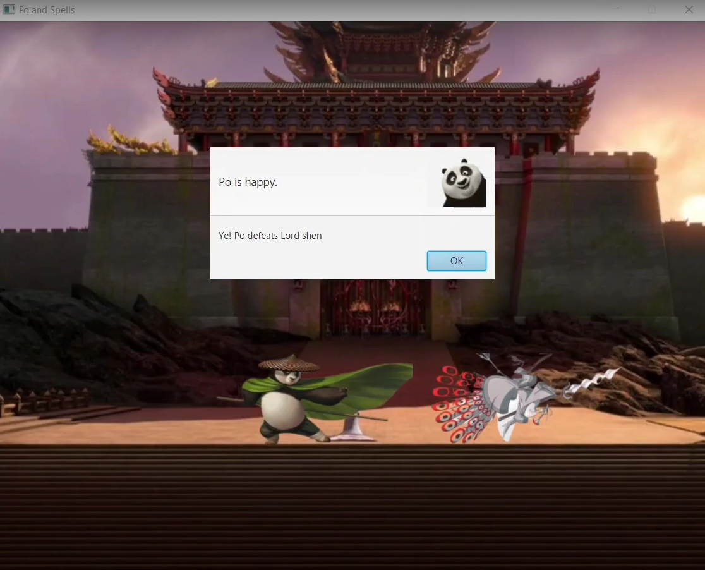

<h2>CodinWithPO</h2>
 

This desktop application is a coding challenge platform designed to provide users with a comprehensive coding experience. Developed by **Ushan Ghosh - 2019331080** and **Mitu Chowdhury - 2019331010** as a project for an undergraduate 2nd-year Java course, this application offers a variety of features to enhance the coding journey. 
 

  

  

  

  

  

  

  

<h3>Features :</h3>

**Coding Problems** 
Users can access 3 classical coding problems that span different difficulty levels. Whether you are a beginner looking to improve your coding skills or an experienced programmer seeking new challenges, our platform has something for everyone.
 

**Storyline-Based Challenges** 
The problems are storyline-based. These challenges allow users to engage in problem-solving within a narrative context, making the coding experience more immersive and engaging.
 

**Verdict Simulation**
Users can view a simulation of the verdict for their code submissions. This feature provides instant feedback, helping users understand the correctness and efficiency of their solutions.
 

**User-Friendly Interface** 
The application boasts an intuitive and user-friendly interface, making it easy for users of all skill levels to navigate and utilize its features.

 

<h3>Technology</h3>

We chose **JavaFX** as the development framework for this project, ensuring a robust and responsive user interface.